# Nautobot Setup

## Nautobot Setup (ALL PLATFORMS)

### Platform to framework mapping

Once you are in the Nautobot UI, on the vertical menu bar scroll down to `Admin`. From the dropdown select `Admin`

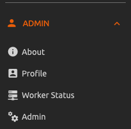

From the `Site administration` page, click on the config menu item

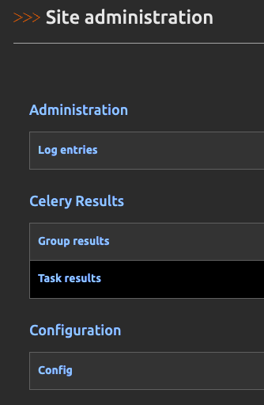

Once in the `Configuration` page, scroll down to the `Golden Configuration` section
You can change all the frameworks for all platforms using the `DEFAULT FRAMEWORK` box or
individually change the `GET CONFIG FRAMEWORK` and `MERGE CONFIG FRAMEWORK` in their boxes.
We are using the `cisco_meraki` platform as an example, you would add all of the platforms
requiring API dispatcher if you are using `GET CONFIG FRAMEWORK` and `MERGE CONFIG FRAMEWORK`.
You don't need to update both `DEFAULT FRAMEWORK` and the individual GET and MERGE frameworks.

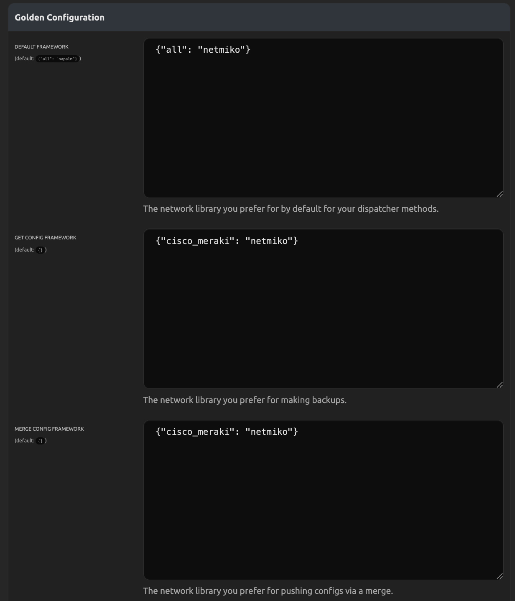

### Creating a Secrets Group

The created `Secrets Group` must be compatible with Golden Config. This means that the
we would require at least two `Secrets` associated to our `Secrets Group`. The `Access Type`
must be `Generic` for all secrets, and for `Secret Type` we need `Password` and `Username`.
You could optionally add a third `Secrets` object, same Access Type, but the Secret Type would be `Secret`

[Nautobot: Create Secrets/Secrets Group](https://docs.nautobot.com/projects/core/en/stable/user-guide/platform-functionality/secret/)

---

## Nautobot Setup (CONTROLLER PLATFORMS)

### Location Type Storing Controllers

The location you use to store controllers need to have a location type that accepts
`Controller` objects. In the Nautobot UI, on the vertical menu bar scroll down to the `ORGANIZATION` dropdown.
Under the `LOCATIONS` section, click on the `Location Types` menu item.

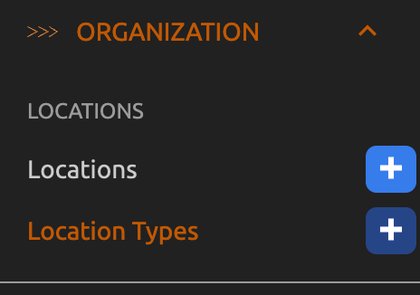

In the `Location Types` page, click on the location type's orange edit pencil on the right
that would store the controllers.

Once in the Location Type object's edit page, add `dcim | controller` to the `Content types` field, and click the blue `Update` button.

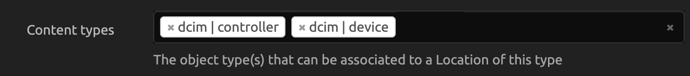

### Controller Device Placeholder

It is best to have a controller device placeholder, to make controller system level API calls
and not controller managed device API calls. For example, we want to grab system information from
Meraki controller, but not from a Meraki AP device.

For Meraki platform, we have two separate platforms, `cisco_meraki` and `meraki_managed`. Devices
managed by Meraki will use the `meraki_managed` platform, and Meraki devices, such as APs will
use the `meraki_managed` devices. In this scenario, we would use the `cisco_meraki` platform for our
controller placeholder device.

We will not go over how to create a device, as that is covered in other documentation. Here is a link
to it for reference

[Nautobot: Create A Device](https://docs.nautobot.com/projects/core/en/stable/user-guide/feature-guides/getting-started/creating-devices/)

### External Integration

Adding controller connectivity to a controller object is done by creating an `External Integration`.
This will contain the remote URL and secrets group for example.

In the Nautobot UI, on the vertical menu bar scroll down to the `EXTENSIBILITY` dropdown. From the dropdown find the
`AUTOMATION` section and click on the `External Integrations` menu item.

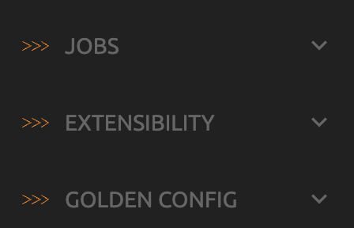

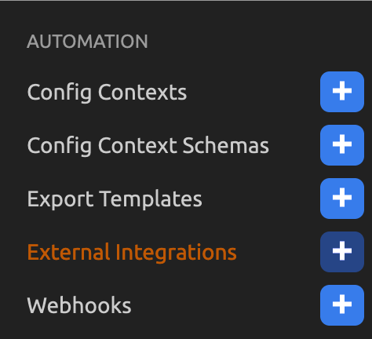

Here is more information on External Integrations

[Nautobot: Create External Integrations](https://docs.nautobot.com/projects/core/en/stable/user-guide/platform-functionality/externalintegration/)

### Controller Creation

In the Nautobot UI, on the vertical menu bar scroll down to the `DEVICES` dropdown. From the dropdown find the
`CONTROLLERS` section and click on the `Controllers` menu item.

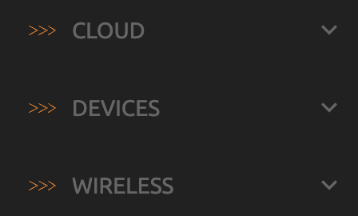

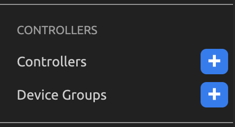

The most important things to have in the controller are external integrations, platform, and controller device.

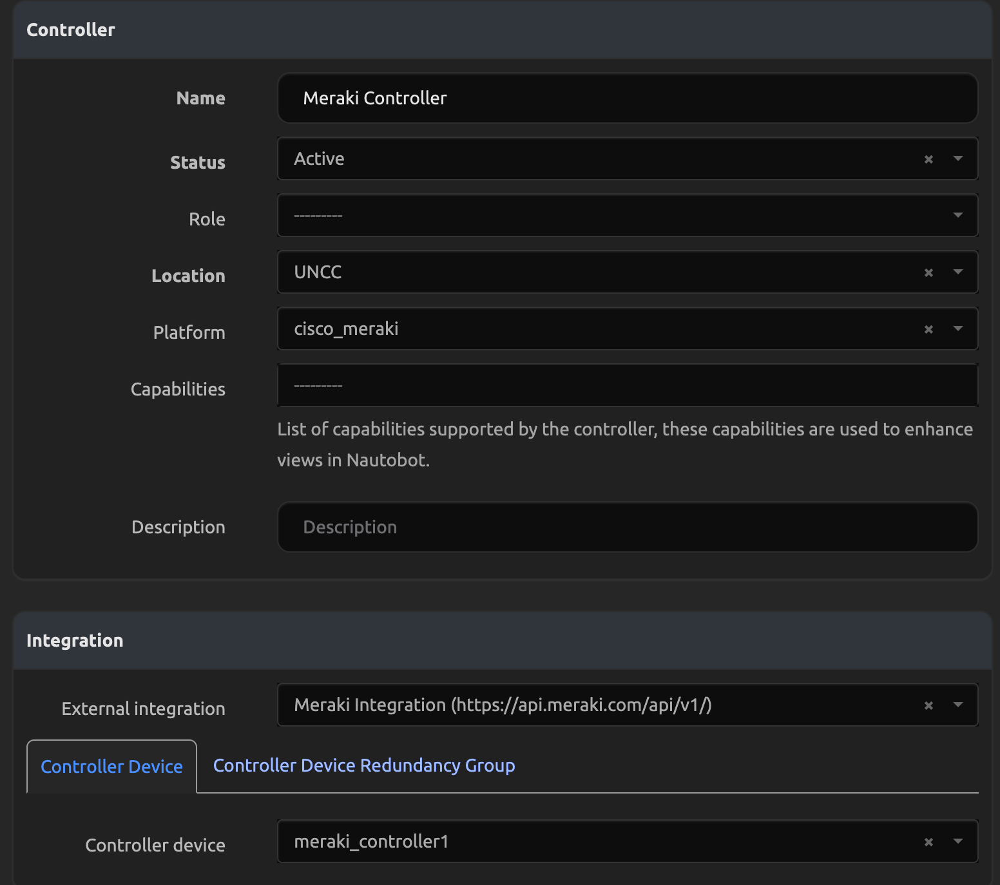

Here is the documentation to create Controller objects

[Nautobot: Create Controller](https://docs.nautobot.com/projects/core/en/stable/user-guide/feature-guides/wireless-networks-and-controllers/#controllers)

### Update Golden Config Settings to not execute a ping test to controllers

It is best to have a separate set of Golden Config Settings for controller based dispatchers. This is because
placeholder controller devices typically do not have an IP, like if the controller is managed by the vendor, like
Meraki which is managed by Cisco in the cloud.

Golden Config tries to perform a connectivity test via ping using the device's IP to TCP ports 22 or 443. If the device does not have an IP,
the job will fail. To disable this, we need to configure it in the Golden Config Settings object. You can have multiple
Golden Config Settings, and each have their own weight, and the heavier the weight, the more preferene Golden Config would
have to use that set of settings.

To limit the devices to use the controller Golden Config Settings, you would use Dynamic Group. This Dynamic Group
should only include the platforms that would not have an IP you could ping.

In the Nautobot UI, on the vertical menu bar scroll down to the `GOLDEN CONFIG` dropdown. From the dropdown find the
`SETUP` section and click on the `Golden Config Settings` menu item.

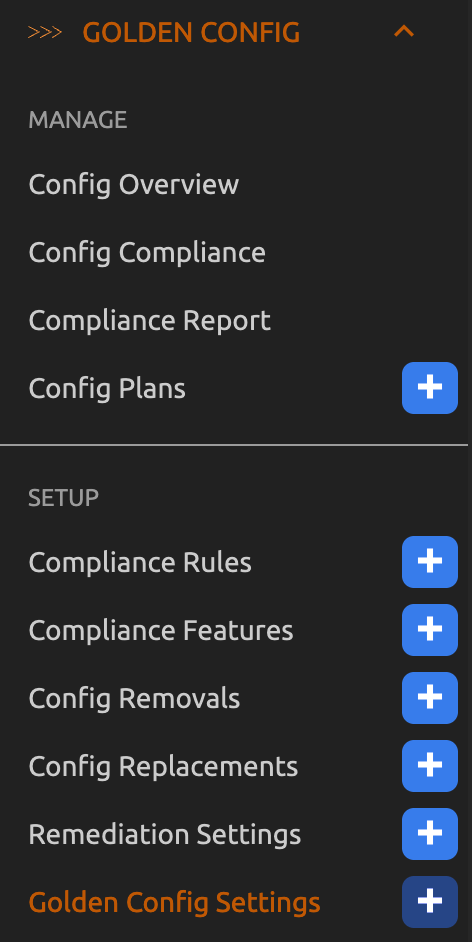

Adjust the weight of the controller specific dispatcher Golden Config Setting

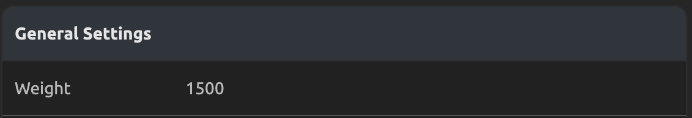

Lastly, you would disable the ping test. You can do this by editing the Golden Config Settings and unchecking
the `Backup Test` box.

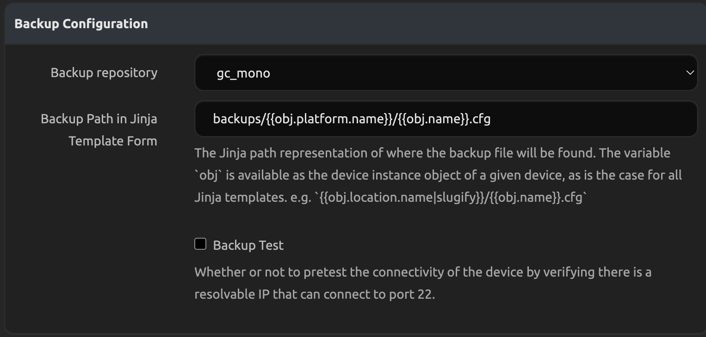

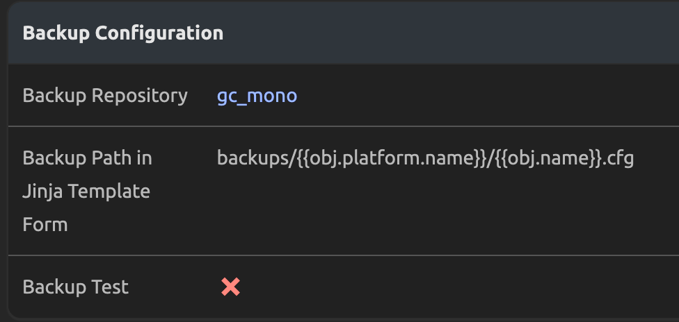
